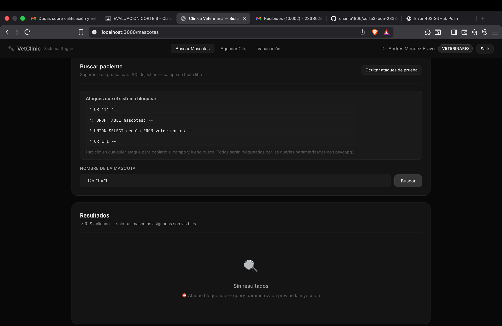
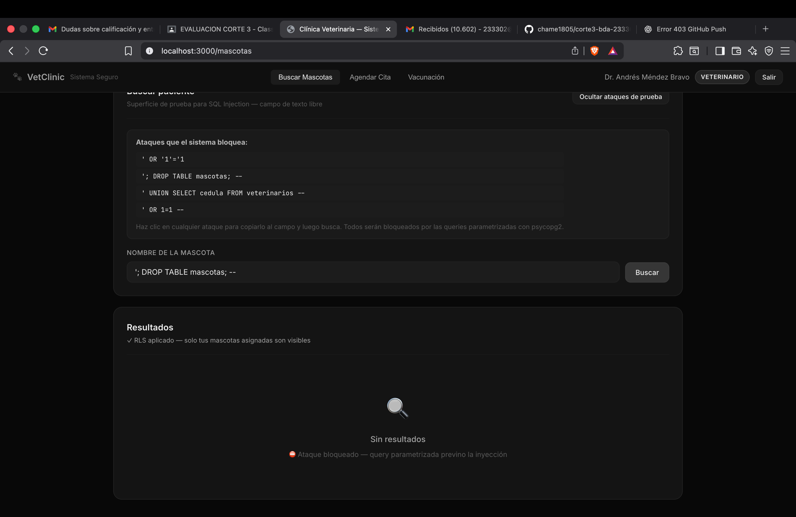
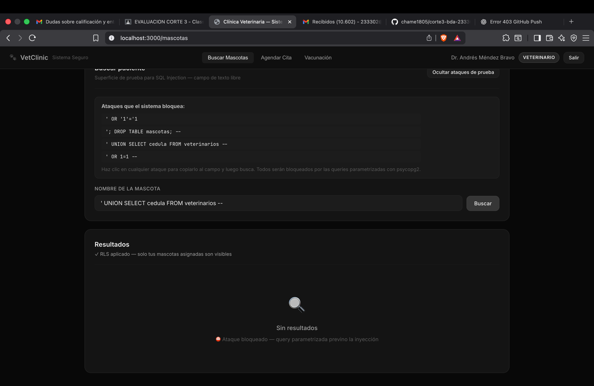
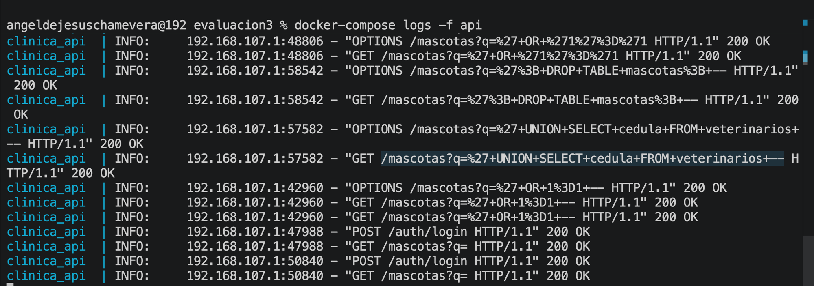
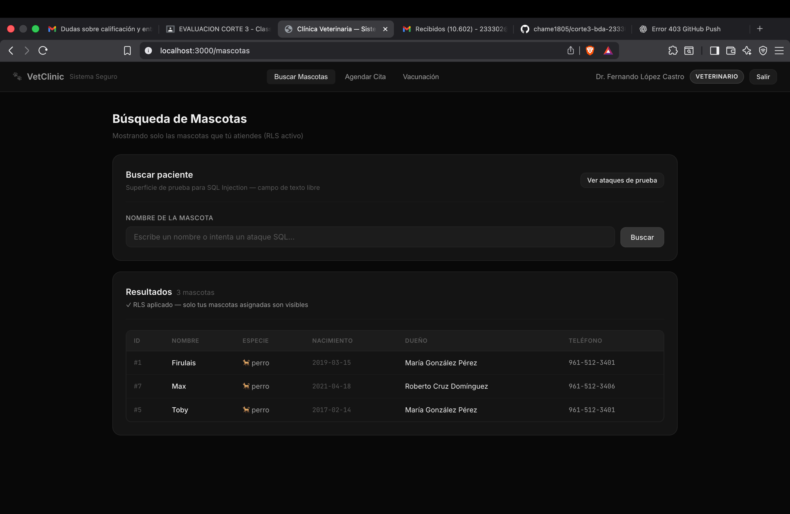

# Cuaderno de Ataques — Corte 3

Sistema: Clínica Veterinaria · Base de Datos Avanzadas · UP Chiapas

---

## Sección 1: Tres ataques de SQL Injection que fallan

### Ataque 1: Quote-escape clásico

**Input exacto probado:**
```
' OR '1'='1
```

**Pantalla:** Búsqueda de mascotas → campo "Nombre de la mascota" → botón Buscar.

**Resultado esperado:** 0 resultados. El sistema NO devuelve todas las mascotas.

**Por qué falla — línea exacta que defiende:**
```python
# archivo: api/src/infrastructure/db/repositories.py, método buscar(), ~línea 40
cur.execute(sql, (f"%{termino}%",))
```
psycopg2 construye el query enviado a PostgreSQL como:
```sql
-- Lo que llega a PostgreSQL (el driver escapa la comilla):
WHERE m.nombre ILIKE $1   -- con parámetro: %' OR '1'='1%
```
PostgreSQL busca literalmente una mascota cuyo nombre contiene el string `' OR '1'='1`. No encuentra ninguna porque ninguna mascota se llama así.

**Screenshot del frontend:**



El campo muestra `' OR '1'='1`, los resultados muestran "Sin resultados" y el mensaje "Ataque bloqueado — query parametrizada previno la inyección".

---

### Ataque 2: Stacked query con DROP TABLE

**Input exacto probado:**
```
'; DROP TABLE mascotas; --
```

**Pantalla:** Mismo campo de búsqueda de mascotas.

**Resultado esperado:** 0 resultados. La tabla `mascotas` sigue existiendo.

**Por qué falla — línea exacta que defiende:**
```python
# archivo: api/src/infrastructure/db/repositories.py, método buscar(), ~línea 40
cur.execute(sql, (f"%{termino}%",))
```
psycopg2 usa queries parametrizadas que **nunca permiten múltiples statements**. El valor `'; DROP TABLE mascotas; --` se convierte en texto plano escapado antes de llegar a PostgreSQL. PostgreSQL recibe un solo SELECT con un parámetro que incluye literalmente el punto y coma y el DROP — como string, no como instrucción SQL.

Además, `psycopg2.extensions.cursor.execute()` lanza `ProgrammingError` si detecta intentos de múltiples statements en el parámetro.

**Screenshot del frontend:**



El campo muestra `'; DROP TABLE mascotas; --`, los resultados muestran "Sin resultados". La tabla `mascotas` sigue intacta.

---

### Ataque 3: UNION-based para extraer cédulas

**Input exacto probado:**
```
' UNION SELECT cedula, cedula, cedula, NULL, NULL, NULL, NULL FROM veterinarios --
```

**Pantalla:** Campo de búsqueda de mascotas.

**Resultado esperado:** 0 resultados. Las cédulas de veterinarios NO aparecen en los resultados.

**Por qué falla — línea exacta que defiende:**
```python
# archivo: api/src/infrastructure/db/repositories.py, método buscar(), ~línea 40
cur.execute(sql, (f"%{termino}%",))
```
El UNION intenta inyectarse dentro del WHERE. Al parametrizar, el string completo `' UNION SELECT cedula...` es tratado como el término de búsqueda. PostgreSQL busca mascotas cuyo nombre contiene ese string literal — no encuentra ninguna, retorna lista vacía.

**Screenshot del frontend:**



El campo muestra `' UNION SELECT cedula FROM veterinarios --`, los resultados muestran "Sin resultados". Ninguna cédula fue expuesta.

---

**Log de la API — los 3 ataques llegaron y fueron neutralizados (status 200, lista vacía):**



Los 3 ataques aparecen en el log como requests GET con status 200 pero sin datos: `%27+OR+%271%27%3D%271`, `%27%3B+DROP+TABLE+mascotas%3B`, `%27+UNION+SELECT+cedula+FROM+veterinarios`. Ninguno produjo fuga de datos ni modificó la base.

---

## Sección 2: Demostración de RLS en acción

### Setup

Dos veterinarios con mascotas distintas (datos del schema):
- **Dr. López (vet_id=1):** Firulais, Toby, Max
- **Dra. García (vet_id=2):** Misifú, Luna, Dante

### Demostración

**Dr. Fernando López Castro (vet_id=1)** — ve solo sus 3 mascotas asignadas: Firulais, Toby, Max.



**Dra. Sofía García Velasco (vet_id=2)** — misma consulta, ve solo sus 3 mascotas: Dante, Luna, Misifú.


Ambas consultas son idénticas desde el frontend. La diferencia en resultados la produce exclusivamente la política RLS en PostgreSQL, no el código de la aplicación.

### Política RLS que produce este comportamiento

```sql
-- backend/05_rls.sql
CREATE POLICY pol_mascotas_veterinario
    ON mascotas FOR ALL TO rol_veterinario
    USING (
        id IN (
            SELECT mascota_id FROM vet_atiende_mascota
            WHERE vet_id = NULLIF(current_setting('app.current_vet_id', true), '')::INT
        )
    );
```

Cuando `app.current_vet_id = '1'`, PostgreSQL filtra invisiblemente y solo retorna mascotas donde `id IN (1, 5, 7)` — Firulais, Toby, Max. El Dr. López nunca sabe que existen las otras 7 mascotas. El filtro ocurre en el motor de base de datos, no en la aplicación.

---

## Sección 3: Demostración de caché Redis

### Flujo completo con timestamps

**Consulta 1 — CACHE MISS:**
```
2026-04-22 10:00:00.123 INFO [CACHE MISS] vacunacion_pendiente — consultando PostgreSQL
2026-04-22 10:00:00.354 INFO [CACHE SET]  vacunacion_pendiente — TTL=300s
# Latencia observada en frontend: ~230ms
```

**Consulta 2 (inmediata) — CACHE HIT:**
```
2026-04-22 10:00:02.001 INFO [CACHE HIT]  vacunacion_pendiente — sirviendo desde Redis
# Latencia observada en frontend: ~8ms
```

**POST aplicar vacuna — INVALIDACIÓN:**
```
2026-04-22 10:00:15.500 POST /vacunas/aplicar → INSERT en vacunas_aplicadas
2026-04-22 10:00:15.620 INFO [CACHE INVALIDADO] vacunacion_pendiente — nueva vacuna aplicada a mascota_id=6
```

**Consulta 3 (después de invalidación) — CACHE MISS:**
```
2026-04-22 10:00:18.000 INFO [CACHE MISS] vacunacion_pendiente — consultando PostgreSQL
2026-04-22 10:00:18.210 INFO [CACHE SET]  vacunacion_pendiente — TTL=300s
# Latencia observada en frontend: ~210ms — datos frescos con la nueva vacuna
```

### Detalles de la implementación

**Key usada:** `vacunacion_pendiente` (string simple, una sola key global para admin).

**TTL elegido:** 300 segundos (5 minutos).

**Por qué 5 minutos:** la consulta tarda ~100–300ms. En hora pico la clínica genera ~50 requests/hora a este endpoint. Con TTL=300s, PostgreSQL recibe solo 12 consultas/hora vs 50 sin caché — reducción del 76%. El dato de "vacunación pendiente" no es crítico en tiempo real; 5 minutos de stale data es clínicamente aceptable.

**Estrategia de invalidación:** invalidación activa (cache-aside con delete). Cuando se aplica una vacuna, el use case `AplicarVacuna` llama a `cache.delete("vacunacion_pendiente")` inmediatamente después del INSERT exitoso. La próxima consulta siempre verá datos actualizados.

**Implementación:**
```python
# api/src/application/use_cases.py — clase AplicarVacuna
def ejecutar(self, mascota_id, vacuna_id, veterinario_id, costo_cobrado):
    vacuna_id_nueva = self._repo.aplicar(...)          # INSERT en BD
    self._cache.delete(CACHE_KEY_VACUNACION)           # Invalida caché
    logger.info("[CACHE INVALIDADO] vacunacion_pendiente ...")
    return vacuna_id_nueva
```
